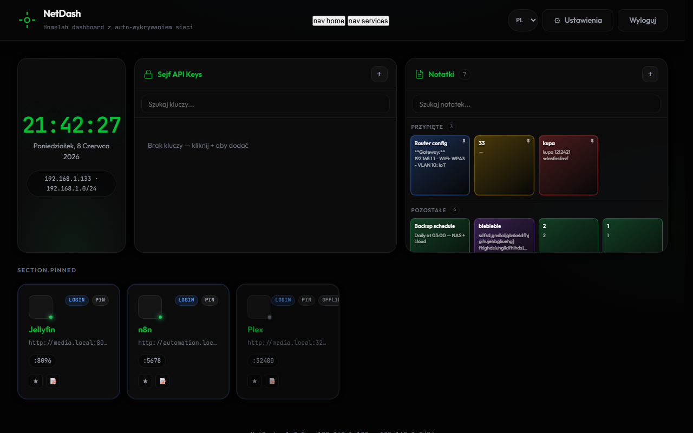
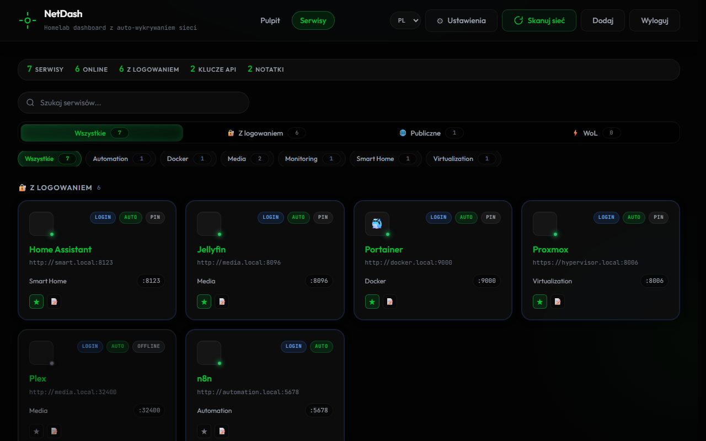
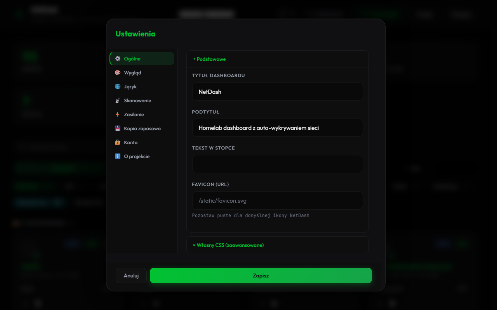
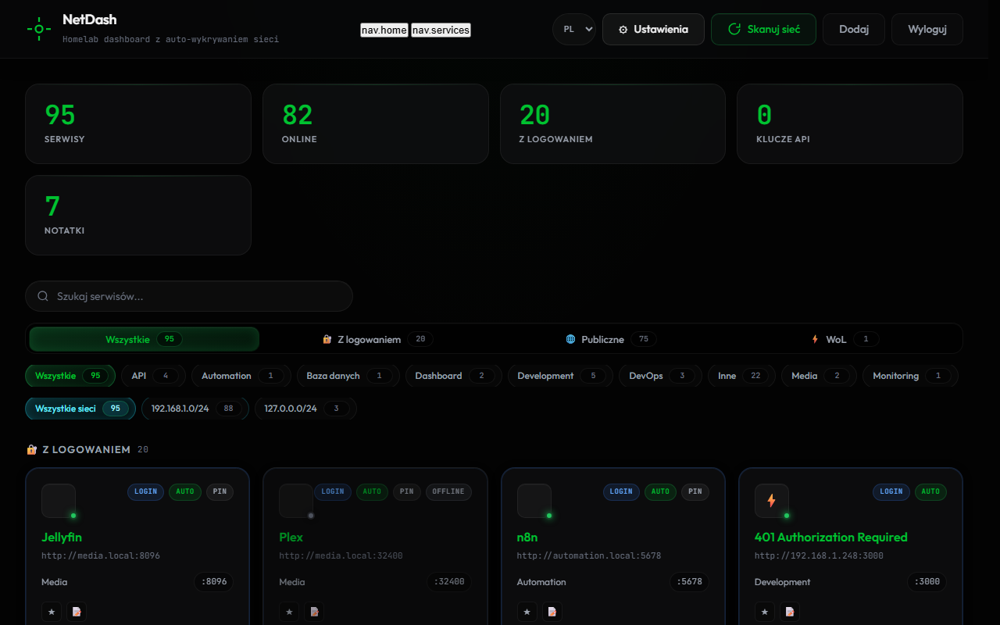

# NetDash

[](app/config.py)
[](LICENSE)
[](requirements.txt)
[](docker-compose.yml)

**A self-hosted homelab dashboard like [Homer](https://github.com/bastienwirtz/homer) / [Homepage](https://github.com/gethomepage/homepage) — with optional on-demand discovery.**

Pin services, keep an encrypted API vault and notes, and **scan the LAN only when you click Scan network**. Default policy is **`on_demand`**: not a continuous LAN scanner.

**Default NetDash port: 18787** — chosen to avoid conflicts with common homelab ports such as Readarr (8787).

> **Recommended deploy:** **Ubuntu VM on Proxmox + [Dockge](dockge/README.md)** — not QNAP. A **2 GB RAM** VM is sufficient for NetDash alone (512M container limit). QNAP is **deprecated** — see **[DEPRECATION-QNAP.md](DEPRECATION-QNAP.md)**.

How to scan (3 steps, IPS/SEP notes): **[docs/SCANNING.md](docs/SCANNING.md)**.

## Quick start (Docker, no git)

Run this on any Linux host with Docker:

```bash
curl -fsSL https://raw.githubusercontent.com/lobrzut/netdash/main/deploy/docker-simple/install.sh | bash
```

Open **http://<server-ip>:18787** and sign in with **`admin` / `changeme`**, then change the password in **Settings → Password**.

> **Port note:** NetDash uses **18787** by default. Set `NETDASH_LISTEN_PORT` in `.env` to change it. If you are migrating an older install on 8787, set `NETDASH_LISTEN_PORT=8787`.

Windows (Docker Desktop): `irm https://raw.githubusercontent.com/lobrzut/netdash/main/deploy/docker-simple/install.ps1 | iex` — see [deploy/docker-simple/](deploy/docker-simple/).

## Screenshots

Dark-theme homelab dashboard with pinned services, API key vault, notes, and network filters.

| Dashboard | Services |
|-----------|----------|
|  |  |

| Settings | Login |
|----------|-------|
|  |  |

> **Screenshots use demo data only** (`*.demo.local`, `10.0.0.x`, masked keys like `sk-demo-…`). Regenerate with `NETDASH_DEMO_MODE=1 python scripts/capture_screenshots.py` (requires Playwright and a running app on port 18787).

## Why NetDash?

| Homer / Homepage | NetDash |
|------------------|---------|
| Manual YAML / Docker labels | **Optional on-demand scan** (CIDR) — or add tiles by hand |
| Static service list | **Service identification** (HTTP title, favicon) when you scan |
| Icons from config | **70+ brand icons** (Jellyfin, Grafana, Plex, and more) + favicon fallback |
| No vault | **Encrypted API key vault** (Fernet) |
| No notes | **Notes widget** with markdown |
| — | **Visibility filters**: login required / public |
| — | **Widgets**: clock, stats, search, optional Pomnia / Network tiles |

## Features

- Homelab **dashboard** — pinned tiles, dark theme, accent color, 70+ [Simple Icons](https://simpleicons.org/)
- **Discovery policies** — `on_demand` (default), `passive` (ARP), `scheduled`, `off`, legacy `adaptive`
- **Manual scan** — full CIDR from settings, **Popular** vs **Basic** ports, targeted **IP:port** probe, **Stop**
- **IPS-friendly** probing — one port at a time per host by default (Symantec SEP / endpoint IPS)
- Safe mode throttles concurrency; it does **not** cut a manual scan down to `/28` (`NETDASH_MANUAL_SCAN_ALLOW_FULL_CIDR`)
- **Auto-remove stale** services — configurable offline days (`NETDASH_STALE_REMOVE_DAYS` or Settings → Scanning)
- JWT auth and encrypted API key vault
- Per-service notes plus Wake-on-LAN / **Sleep-on-LAN** (install scripts auto-detect MAC per OS)
- **Mobile-friendly WOL/SOL** — tile action buttons tappable on touch devices
- Persistent online/offline health checks (local-IP services probed like remote hosts)
- i18n: English, Polish, German, Ukrainian
- **Optional Pomnia stats tile** — live knowledge-base counts; **“Open dashboard”** when Pomnia is online; Bearer via Settings or `NETDASH_POMNIA_TOKEN`
- **Optional Network tile** — LAN/WAN info, link latency; off by default
- **Remote discovery agent** (v1.3.112): lightweight LAN scanner on a separate host (`POST /api/discovery/import`)

## Remote Discovery Agent

If NetDash runs on a low-power NAS (for example QNAP) without safe LAN scan access, disable local scanning and use a remote agent:

| Host | Role |
|------|------|
| QNAP `.150` | Dashboard only — `NETDASH_SCAN_DISABLED=true` |
| Homelab `.201` | `deploy/agent/docker-compose.yml` — `network_mode: host`, arp-scan |

See [`deploy/agent/README.md`](deploy/agent/README.md) and [`deploy/qnap/README.md`](deploy/qnap/README.md). Prefer a Linux VM instead of QNAP — **[DEPRECATION-QNAP.md](DEPRECATION-QNAP.md)**.

## What's new

### v1.3.157

- **Positioning** — Homer/Homepage-like dashboard first; discovery is optional and **on demand** (not a 24/7 LAN scanner).
- **Docs** — [docs/SCANNING.md](docs/SCANNING.md) (3-step scan, popular vs basic, targeted probe, SEP/IPS, safe mode vs full `/24`).
- README / Dockge / DEPLOYMENT / `.env.example` aligned with v1.3.150–156 (policies, popular ports, probe, Watchtower `nickfedor`).

### v1.3.150–156 (scanning model)

- **Policies** — `on_demand` (default in Dockge), `off`, `scheduled`, `passive` ARP, legacy `adaptive`.
- **Manual `/24`** — safe mode throttles (IPS-friendly) but does **not** shrink to `/28`; opt out with `NETDASH_MANUAL_SCAN_ALLOW_FULL_CIDR=false`.
- **UI stays up** during a full CIDR scan (internal `/28` work chunks, scaled timeout, cap 7200 s).
- **Popular ports** (~45 homelab) on **live hosts only**; **targeted IP:port** probe; never 1–65535.
- **Duplicate upsert** — add/probe by `(host, port)`; probe rows are customized (stale-remove skips them).
- Health lock + `_known_ips` rotation fix (v1.3.152).

### Earlier highlights

- **IPS-friendly / stealth** (v1.3.149) — `NETDASH_IPS_FRIENDLY` and per-host delays (on by default).
- **Mobile WOL/SOL**, **SoL MAC auto-detect**, **Pomnia “Open dashboard”**, **stale auto-remove**, **local-IP health** (v1.3.143–148).
- **2 GB VM + Dockge** — 512M limit, Watchtower `nickfedor/watchtower:1.7.1` (Docker 29+). QNAP deprecated.

Full version history: **[CHANGELOG.md](CHANGELOG.md)**. See [ROADMAP.md](ROADMAP.md) for remaining work.

## Deploy from GitHub

Clone and run on a fresh Linux server (or locally):

```bash
git clone https://github.com/lobrzut/netdash.git
cd netdash
cp .env.example .env
# Edit .env and set NETDASH_SECRET_KEY (password defaults to changeme)
docker compose up -d --build
```

Open **http://localhost:18787** (or `http://<server-ip>:18787` on your LAN).

Default login: **`admin` / `changeme`** (synced from env on container start when `NETDASH_SYNC_ADMIN_PASSWORD=true`).  
**Change the password immediately after first login** (Settings → Password).

Full deployment instructions: **[DEPLOYMENT.md](DEPLOYMENT.md)**.

### Dockge (homelab)

On a Linux host with [Dockge](https://github.com/louislam/dockge):

```bash
git clone https://github.com/lobrzut/netdash.git /opt/stacks/netdash
cd /opt/stacks/netdash && cp .env.example .env
```

In Dockge: **Scan Stacks Folder** → deploy stack **netdash**.

Compose file: **[dockge/compose.yaml](dockge/compose.yaml)** (alias [dockge/docker-compose.yml](dockge/docker-compose.yml)). Copy or symlink it into the expected stack root if required by your Dockge setup.

LAN scanning requires `network_mode: host` (Linux only) — see **[dockge/README.md](dockge/README.md)**.

## Development quick start

### Docker (recommended)

```bash
curl -fsSL https://raw.githubusercontent.com/lobrzut/netdash/main/deploy/docker-simple/install.sh | bash
```

Manual alternative: [`deploy/docker-simple/docker-compose.yml`](deploy/docker-simple/docker-compose.yml) + [`.env.example`](deploy/docker-simple/.env.example), then run `docker compose up -d`.

### Local Python development (3.12+)

```bash
git clone https://github.com/lobrzut/netdash.git
cd netdash
python -m venv .venv
# Windows: .venv\Scripts\activate
# Linux/macOS: source .venv/bin/activate
pip install -r requirements.txt
cp .env.example .env   # optional for local dev; config.py defaults also work
python run.py
```

Shortcuts: Windows `.\start.ps1`, Linux `./start.sh`.

## Network scanning

NetDash is **not** a continuous LAN scanner. Default (Dockge): **`on_demand`** — no background TCP. Use **Scan network** when you want an inventory. Details: **[docs/SCANNING.md](docs/SCANNING.md)**.

### Scan in 3 steps

1. Sign in and set LAN CIDR (`NETDASH_SCAN_CIDR` or **Settings → Automatic discovery**).
2. Leave policy on **On demand** (recommended with Symantec SEP / endpoint IPS).
3. Click **Scan network** — choose **Popular** ports (homelab), **Basic** (short list), or a **targeted IP:port** probe. **Stop** cancels the job.

| Policy | Background | Best for |
|--------|------------|----------|
| **`on_demand`** (default in Dockge) | None | Homelab dashboard — manual **Scan network** only |
| **`off`** | None | Dashboard-only; add services manually |
| **`passive`** | ARP table read every ~10 min | Light device list without TCP port sweep |
| **`scheduled`** | One full IPS-friendly cycle at `03:00` UTC or every `24h` | Nightly inventory without continuous load |
| **`adaptive`** (legacy) | Continuous TCP in `/28` chunks | Old behaviour; may trigger SEP blocks |

**Manual scan** always works when local scan is not disabled (`NETDASH_SCAN_DISABLED`). Hard limits apply (`NETDASH_MANUAL_SCAN_MAX_HOSTS`, max `/24`). Safe mode throttles; full CIDR is allowed unless `NETDASH_MANUAL_SCAN_ALLOW_FULL_CIDR=false`.

> **Docker note:** without `network_mode: host`, the container scans its own bridge network (172.x), not your LAN. On Linux, `docker-compose.yml` uses `network_mode: host`. On Windows/macOS, disable host mode and set `NETDASH_SCAN_CIDR=192.168.1.0/24` in `.env` or in Settings.

### Recommended homelab config (192.168.1.0/24, SEP on Windows)

```env
NETDASH_SCAN_CIDR=192.168.1.0/24
NETDASH_DISCOVERY_POLICY=on_demand
NETDASH_DISCOVERY_ENABLED=false
NETDASH_IPS_FRIENDLY=true
NETDASH_SCAN_SAFE_MODE=true
NETDASH_SCAN_PORT_PROFILE=popular
NETDASH_AUTO_DISCOVERY_ALL_PORTS=false
```

Use **Scan network** after adding devices (or weekly). For a host list without TCP, use `NETDASH_DISCOVERY_POLICY=passive` and `NETDASH_DISCOVERY_ENABLED=true`. Avoid **`adaptive`** on SEP-protected VLANs.

### IPS-friendly scanning (Symantec SEP / endpoint IPS)

On LANs where workstations run Symantec Endpoint Protection or similar endpoint IPS, aggressive port scanning can trigger a **600 s block** on NetDash's source IP (`The client will block traffic from IP address … for the next 600 seconds`).

**IPS-friendly mode** (on by default) probes each host gently: limited per-host parallelism, randomized port order, and a jittered delay between probes to the same host.

| Variable | Default | Purpose |
|----------|---------|---------|
| `NETDASH_IPS_FRIENDLY` | `true` | Master switch for gentle per-host probing |
| `NETDASH_PORT_PARALLEL_PER_HOST` | `1` | Max concurrent port probes to one host |
| `NETDASH_PORTS_PER_HOST_DELAY` | `0.3` | Seconds between probes to the same host |
| `NETDASH_PORTS_PER_HOST_JITTER` | `0.2` | Random extra delay (0…N s) per probe |
| `NETDASH_SCAN_RANDOMIZE_PORTS` | `true` | Randomize port order (avoids sequential scan signatures) |

If SEP still blocks NetDash, increase `NETDASH_PORTS_PER_HOST_DELAY` (e.g. `0.6`–`1.0`). Set `NETDASH_IPS_FRIENDLY=false` only on isolated lab networks.

## Low-resource hardware profile (RPi, older PC, N100, 2 GB VM)

NetDash is designed to run on low-resource homelab hardware. A **2 GB Proxmox VM** is enough for NetDash solo (512M container limit in `dockge/compose.yaml`). Safe scan mode (`NETDASH_SCAN_SAFE_MODE=true`) is on by default.

| Problem | Recommendation |
|---------|----------------|
| Host becomes unstable during scans | Keep safe mode; use **on_demand** + occasional **Scan network** |
| Need full LAN coverage | `NETDASH_DISCOVERY_POLICY=scheduled` (nightly) or manual **Scan network** with `/24` |
| Manual scan on strong hardware | Keep `NETDASH_SCAN_SAFE_MODE=true` on shared VLANs; `/28` preset if you want a careful subset |
| Scans are too slow on strong hardware | Use **scheduled** or manual scan; avoid legacy **`adaptive`** on SEP VLANs |
| Full port list needed | `NETDASH_SCAN_PORT_PROFILE=all_listed` (manual, live hosts only) on 4 GB+ VM |
| Discovery overloads weak host | `NETDASH_DISCOVERY_POLICY=on_demand` or `off` |
| Symantec SEP / IPS blocks NetDash IP | IPS-friendly is on; increase `NETDASH_PORTS_PER_HOST_DELAY` |
| Health checks consume too many resources | Increase health-check interval (for example 120s) or disable it |
| Stale offline services clutter the list | Enable auto-remove in **Settings → Scanning** or set `NETDASH_STALE_REMOVE_DAYS=7` |

Example `.env` for Proxmox VM 2 GB (on-demand — or run `bash dockge/deploy-balanced.sh`):

```env
NETDASH_DISCOVERY_POLICY=on_demand
NETDASH_DISCOVERY_ENABLED=false
NETDASH_SCAN_SAFE_MODE=true
NETDASH_SCAN_CIDR=192.168.1.0/24
NETDASH_AUTO_DISCOVERY_ALL_PORTS=false
NETDASH_AUTO_DISCOVERY_ALWAYS_CHUNK=true
```

Example `.env` for low-resource hosts:

```env
NETDASH_SCAN_SAFE_MODE=true
NETDASH_SCAN_CIDR=192.168.1.0/28
```

Check profile output: `curl -s http://127.0.0.1:18787/api/health` → `scan_safe_mode`, `resource_profile`, `discovery_policy`.

Deployment details: **[DEPLOYMENT.md](DEPLOYMENT.md)** · Dockge: **[dockge/README.md](dockge/README.md)** · QNAP (deprecated): **[DEPRECATION-QNAP.md](DEPRECATION-QNAP.md)**.

## Deployment profiles

| Profile | Run command | URL |
|---------|-------------|-----|
| **Local / dev** | `python run.py`, `start.ps1`, `start.sh` | http://localhost:18787 |
| **Server / Docker** | `docker compose up -d` (Linux, `network_mode: host`) | http://<server-ip>:18787 |

More options: **[DEPLOYMENT.md](DEPLOYMENT.md)** · simple Docker: **[deploy/docker-simple/](deploy/docker-simple/)** · QNAP: **[deploy/qnap/](deploy/qnap/)** · SSH deploy: **[deploy/README.md](deploy/README.md)**.

## Production on Linux

```bash
sudo mkdir -p /opt/netdash/data
cd /opt/netdash
git clone https://github.com/lobrzut/netdash.git .
cp .env.example .env
# Set NETDASH_SECRET_KEY (>=32 random chars); default login is admin/changeme
docker compose up -d --build
docker compose ps   # expected: healthy
```

SQLite path: `./data/netdash.db` (volume `./data:/app/data`).

### Deploy from Windows (SSH)

```powershell
$env:NETDASH_SSH_HOST = "user@your-server"
$env:NETDASH_SSH_PASSWORD = "your-ssh-password"
$env:NETDASH_SSH_HOSTKEY = "ssh-ed25519 255 ..."
.\deploy\install.ps1
```

Linux rsync option: `NETDASH_SSH_HOST=user@your-server ./deploy/install.sh`.

### systemd (without Docker)

```bash
sudo useradd -r -m netdash || true
cd /opt/netdash
python3 -m venv .venv && .venv/bin/pip install -r requirements.txt
cp .env.example .env
sudo cp deploy/netdash.service /etc/systemd/system/
sudo systemctl daemon-reload
sudo systemctl enable --now netdash
```

## Configuration

| Variable | Description |
|----------|-------------|
| `NETDASH_SECRET_KEY` | JWT signing key and API vault encryption key (**required** for Docker) |
| `NETDASH_DEFAULT_ADMIN_USER` | Default admin username (`admin`) |
| `NETDASH_DEFAULT_ADMIN_PASSWORD` | Admin password from env (`changeme` by default — change after first login) |
| `NETDASH_SYNC_ADMIN_PASSWORD` | Sync admin password from env on every start (`true` by default; set to `false` after changing in UI) |
| `NETDASH_SCAN_CIDR` | Networks for discovery (and Docker bridge LAN override) |
| `NETDASH_DISCOVERY_POLICY` | **`on_demand`** (recommended), `off`, `scheduled`, `passive`, or legacy `adaptive` |
| `NETDASH_DISCOVERY_SCHEDULE` | For `scheduled`: `03:00` (daily UTC) or `24h` / `6h` interval |
| `NETDASH_PASSIVE_INTERVAL` | Seconds between passive ARP reads (default `600`) |
| `NETDASH_DISCOVERY_ENABLED` | Master switch for background policies (`scheduled`, `passive`, `adaptive`); off for `on_demand` |
| `NETDASH_DISCOVERY_MODE` | Legacy — mapped to policy when `NETDASH_DISCOVERY_POLICY` unset |
| `NETDASH_SCAN_SAFE_MODE` | Safe manual scan throttling (`true` by default); does not block `/24` |
| `NETDASH_MANUAL_SCAN_ALLOW_FULL_CIDR` | Manual scan may use full `/24` (`true` by default) |
| `NETDASH_SCAN_PORT_PROFILE` | Manual ports: `safe` \| `popular` \| `all_listed` |
| `NETDASH_SCAN_ALL_PORTS` | Deep-probe live hosts on ~190 service ports during **manual** scan (`false`; same as `all_listed`) |
| `NETDASH_AUTO_DISCOVERY_ALL_PORTS` | Gradual ~190-port probe on live hosts in auto mode (`false` by default on 2 GB VMs) |
| `NETDASH_AUTO_DISCOVERY_ALWAYS_CHUNK` | Never scan full /24 in one auto cycle (`true` by default) |
| `NETDASH_MANUAL_SCAN_MAX_HOSTS` | Hard cap for manual scan host count (default `256`) |
| `NETDASH_MANUAL_SCAN_TIMEOUT_CAP` | Wall-clock cap for scaled manual scan (default `7200`) |
| `NETDASH_IPS_FRIENDLY` | Gentle per-host port probing to avoid endpoint IPS blocks (`true` by default) |
| `NETDASH_PORT_PARALLEL_PER_HOST` | Max concurrent port probes to one host when IPS-friendly (default `1`) |
| `NETDASH_PORTS_PER_HOST_DELAY` | Seconds between port probes to the same host (default `0.3`) |
| `NETDASH_PORTS_PER_HOST_JITTER` | Random extra delay per same-host probe (default `0.2`) |
| `NETDASH_SCAN_RANDOMIZE_PORTS` | Randomize port probe order (`true` by default) |
| `NETDASH_STALE_REMOVE_DAYS` | Auto-remove auto-discovered offline services after N days (`0` = off) |
| `NETDASH_HEALTH_OFFLINE_AFTER_FAILURES` | Mark service offline after N consecutive failed health probes (default `2`) |
| `NETDASH_BUILD_DATE` | Optional build date for About panel |

See **[.env.example](.env.example)** for the full list.

## Stack

- **Backend:** FastAPI, SQLAlchemy, SQLite
- **Frontend:** Vanilla JavaScript (no Node.js build step)
- **Auth:** JWT + bcrypt
- **Vault:** Fernet (`cryptography`)

## Project structure

```text
netdash/
├── app/
│   ├── main.py       # API routes
│   ├── scanner.py    # Discovery / scan
│   ├── icons.py      # Brand icons
│   ├── vault.py      # Key encryption
│   └── static/       # Frontend
├── docs/SCANNING.md  # How to scan (on demand)
├── deploy/
├── dockge/           # Proxmox + Dockge (recommended)
├── docker-compose.yml
├── Dockerfile
└── run.py
```

## Roadmap

- [x] Online/offline status and health checks
- [x] Per-service notes and Wake-on-LAN
- [x] Homer YAML import (MVP)
- [ ] YAML export (Homer compatibility)
- [x] ARP-based device discovery
- [ ] Multi-user support

## Acknowledgements

- **[Homer](https://github.com/bastienwirtz/homer)** (Apache-2.0) — UI inspiration and YAML import compatibility.
- **[Homepage](https://github.com/gethomepage/homepage)** — homelab dashboard category (widgets / service directory).
- **[GPTWOL](https://github.com/Misterbabou/gptwol)** (MIT, Misterbabou) — Wake/Sleep-on-LAN ideas and optional HTTP gateway integration (`gptwol_url` in settings). NetDash implements WoL/SOL and ARP discovery independently and is not a GPTWOL fork.

## License

MIT — suitable for portfolio, homelab, and commercial use.

---

*A Homer/Homepage-like homelab dashboard with optional on-demand discovery.*
