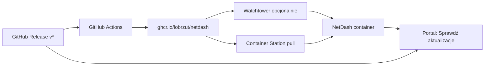

# NetDash na QNAP Container Station — wdrożenie i auto-aktualizacja

Przewodnik dla **QNAP NAS** z **Container Station** (Linux Docker). Repozytorium: [lobrzut/netdash](https://github.com/lobrzut/netdash)

Przykłady:
- **QNAP NAS:** `http://192.168.1.150:18787`
- **Homelab Linux:** `http://192.168.1.201:18787`

Port `NETDASH_PORT` domyślnie **18787** — unika kolizji z Readarr (**8787**). Na QNAP z Readarr **nie** używaj 8787 dla NetDash.

---

## Architektura auto-aktualizacji



| Warstwa | Rola |
|---------|------|
| **GitHub Actions** | Po tagu `v*` buduje obraz i publikuje na GHCR |
| **GHCR** | Gotowy obraz — bez `git` na QNAP |
| **Watchtower** (`docker-compose.full.yml` lub profil `auto-update`) | Co 24 h pobiera `:latest` z GHCR i restartuje NetDash (tylko z etykietą) |
| **Portal NetDash** | Ustawienia → O projekcie → **Sprawdź aktualizacje** (GitHub API) |
| **Aktualizuj teraz** (opcjonalnie) | Wymaga montowania `docker.sock` — tylko dla zaawansowanych |

**Bezpieczeństwo:** w podstawowym `docker-compose.yml` Watchtower **nie startuje** (profil `auto-update`). W **`docker-compose.full.yml`** Watchtower jest od razu w stacku — importuj ten plik tylko jeśli chcesz auto-update. Obraz NetDash musi być **`:latest`** (nie semver) — inaczej Watchtower nie podmieni wersji. Przycisk „Aktualizuj teraz” wymaga jawnej konfiguracji i montowania gniazda Docker (ryzyko — patrz niżej; na QNAP zwykle niedostępne).

---

## Wymagania

- QNAP z Container Station 2.x+
- Dostęp do internetu (pobieranie obrazu z `ghcr.io`)
- Sieć LAN — NetDash skanuje sieć w trybie **`network_mode: host`** (jak na Linuxie)

> **Uwaga:** `network_mode: host` na QNAP działa inaczej niż na czystym Linuxie — skan LAN często wymaga jawnego CIDR. Compose **v1.3.81+** ma `NETDASH_SCAN_CIDR=192.168.1.0/24`. Gdy host mode nie skanuje LAN, użyj [`docker-compose.bridge.yml`](../deploy/qnap/docker-compose.bridge.yml). Szczegóły: [deploy/qnap/README.md — Skan sieci](../deploy/qnap/README.md#skan-sieci--nie-działa--nie-widzę-przycisku).

---

## Wdrożenie początkowe (bez git na NAS)

> **Najprostsza ścieżka:** **[deploy/qnap/README.md](../deploy/qnap/README.md)** — import compose z URL w Container Station. Poniżej wersja rozszerzona.

### 1. Przygotuj folder na QNAP

Przez SSH lub File Station utwórz katalog, np.:

```bash
mkdir -p /share/Container/netdash/data
cd /share/Container/netdash
```

### 2. Pliki compose i `.env`

Skopiuj z repozytorium GitHub (na PC):

- `docker-compose.yml`
- `.env.example` → `.env`

Na QNAP w `.env` (opcjonalnie — compose v1.3.80+ ma twarde domyślne):

```env
# NETDASH_SECRET_KEY opcjonalny — entrypoint zapisze klucz w data/.secret
NETDASH_SCAN_CIDR=192.168.1.0/24
NETDASH_IMAGE_TAG=1.3.82
```

> **Homelab (v1.3.80+):** login `admin`/`changeme` działa bez env w CS; sync hasła przy starcie także ze starym wolumenem. Po zmianie hasła w portalu ustaw `NETDASH_SYNC_ADMIN_PASSWORD=false`.

Opcjonalnie sieć skanowania:

```env
NETDASH_SCAN_CIDR=192.168.1.0/24
```

### 3. Container Station — utwórz aplikację

1. **Container Station** → **Create** → **Create Application**
2. **Import** → wskaż `docker-compose.yml` z folderu `/share/Container/netdash`
3. Upewnij się, że wolumen `./data` wskazuje na `/share/Container/netdash/data`
4. **Create** / **Start**

Alternatywa: w Dockge na innym hoście — patrz [DEPLOYMENT.md](../DEPLOYMENT.md).

### 4. Pierwsze uruchomienie obrazu z GHCR

Jeśli na QNAP nie ma lokalnego builda, w SSH (w katalogu stacka):

```bash
docker compose pull
docker compose up -d
```

Obraz: `ghcr.io/lobrzut/netdash:latest`

### 5. Weryfikacja

```bash
curl -s http://127.0.0.1:18787/api/health
```

W przeglądarce: `http://192.168.1.150:18787` (QNAP) → zaloguj się → **Ustawienia** → **O projekcie** → **Sprawdź aktualizacje**.

---

## Rozwiązywanie problemów

Szczegóły crash loop (`Errno 98`), duplikatów aplikacji w Container Station i kolizji z Readarr: **[deploy/qnap/README.md](../deploy/qnap/README.md#rozwiązywanie-problemów-qnap--container-station)**.

---

## Auto-aktualizacja — Watchtower (zalecane na QNAP)

### Metoda 1 — jeden plik (Container Station, bez SSH)

Import URL:

```
https://raw.githubusercontent.com/lobrzut/netdash/main/deploy/qnap/docker-compose.full.yml
```

Dwa kontenery: `netdash` + `netdash-watchtower`. Obraz NetDash: **`ghcr.io/lobrzut/netdash:latest`** (od v1.3.82). Sprawdzanie co **24 h**. Tylko kontenery z etykietą `com.centurylinklabs.watchtower.enable=true`.

> **Częsty błąd:** compose z tagiem `1.3.79` — Watchtower pobiera `:latest`, ale recreate używa starego tagu z compose → wersja się nie zmienia. Użyj `:latest` w full.yml lub ręczny Pull.

### Metoda 2 — profil auto-update (SSH)

Watchtower w `docker-compose.yml` w profilu **`auto-update`** — domyślnie **nie startuje**.

```bash
docker compose --profile auto-update up -d
```

Zmienne (opcjonalnie w `.env`):

```env
WATCHTOWER_POLL_INTERVAL=86400
```

### Ręczne jednorazowe odświeżenie (bez czekania)

```bash
docker run --rm \
  -v /var/run/docker.sock:/var/run/docker.sock \
  containrrr/watchtower:1.7.1 \
  --run-once --cleanup netdash
```

### Wyłączenie auto-aktualizacji

```bash
docker compose stop netdash-watchtower
docker compose rm -f netdash-watchtower
```

---

## Aktualizacja ręczna (bez Watchtower)

```bash
cd /share/Container/netdash
docker compose pull
docker compose up -d
```

Dane w `./data` (SQLite, ikony) pozostają.

---

## Portal — Sprawdź aktualizacje

W **Ustawienia → O projekcie**:

- **Sprawdź aktualizacje** — porównuje wersję z GitHub Releases (`/releases/latest`)
- Link **Changelog** — strona release na GitHub
- Status: „Masz najnowszą wersję” lub „Dostępna vX.Y.Z”

Nie pobiera ani nie restartuje kontenera — tylko informuje. Gdy wersja na GitHub jest nowsza, a przycisk **Aktualizuj teraz** się nie pojawia, na QNAP brakuje zwykle `docker.sock` — użyj Watchtower lub Pull w Container Station. Do faktycznej aktualizacji użyj Watchtower lub `docker compose pull`.

---

## Opcja zaawansowana: „Aktualizuj teraz” z portalu

**Ryzyko:** montowanie `/var/run/docker.sock` daje kontenerowi NetDash pełną kontrolę nad Dockerem na hoście.

Włączenie tylko jeśli akceptujesz to ryzyko:

1. W `docker-compose.yml` odkomentuj:

   ```yaml
   volumes:
     - ./data:/app/data
     - /var/run/docker.sock:/var/run/docker.sock
   ```

2. W `.env`:

   ```env
   NETDASH_UPDATE_APPLY_ENABLED=true
   ```

3. `docker compose up -d`

W portalu pojawi się **Aktualizuj teraz** (gdy dostępna nowsza wersja) — pobiera obraz z GHCR i restartuje kontener `netdash`.

---

## GitHub Actions i GHCR

Przy każdym tagu `v*` (np. `v1.3.72`) workflow `.github/workflows/docker-publish.yml`:

- buduje obraz Docker,
- publikuje `ghcr.io/lobrzut/netdash:latest` oraz `ghcr.io/lobrzut/netdash:1.3.72`.

Pierwszy raz obraz musi powstać z release na GitHub — dopiero wtedy `docker compose pull` na QNAP ma skąd pobrać.

---

## Ograniczenia

| Temat | Opis |
|-------|------|
| **Brak git na QNAP** | Używaj obrazu GHCR, nie `git pull` |
| **Host network na QNAP** | Skan LAN może wymagać `NETDASH_SCAN_CIDR` |
| **GHCR prywatny** | Domyślnie pakiet publiczny; przy prywatnym — `docker login ghcr.io` na NAS |
| **Watchtower** | Restartuje kontener bez pytania — włącz świadomie |
| **docker.sock** | Pełne uprawnienia do hosta — unikaj jeśli nie musisz |
| **Watchdog** | `deploy/netdash-watchdog.sh` restartuje przy awarii health — to nie aktualizacja wersji |

---

## Powiązane pliki

- [`deploy/qnap/docker-compose.yml`](../deploy/qnap/docker-compose.yml) — compose pod QNAP (import URL)
- [`deploy/qnap/README.md`](../deploy/qnap/README.md) — krótki przewodnik PL
- [`docker-compose.yml`](../docker-compose.yml) — NetDash + Watchtower (profil)
- [`dockge/compose.yaml`](../dockge/compose.yaml) — ten sam stack dla Dockge
- [`DEPLOYMENT.md`](../DEPLOYMENT.md) — ogólny przewodnik wdrożenia
- [`deploy/netdash-watchdog.sh`](../deploy/netdash-watchdog.sh) — odzyskiwanie po awarii (nie update)
